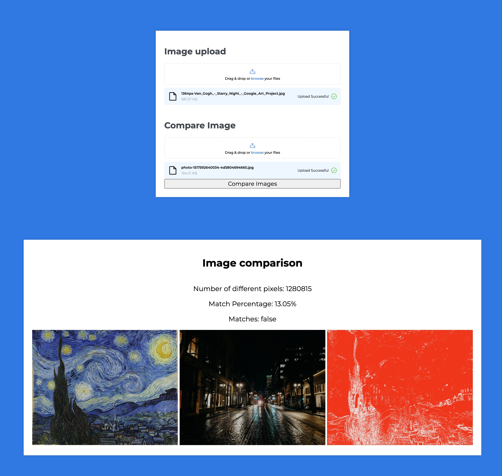

# CADMUS Task

## Situation:
1. You are an art dealer who has to constantly deal with fakes and unauthorized reproductions
2. You need an automated computer system that can “look” at 2 images and figure out the degree of similarity between them (e.g. picture 1 is 80% similar to picture 2)
3. There is no training data set available for your computer system to get trained on (e.g. it cannot identify a house is a house)
4. An example of 2 images that need to be compared has been provided above
5. What parameters will you use (which a computer system can also objectively and quantitatively measure for comparison purposes) so that you can get a similarity score?

## Run the program
`node app.js` in the terminal

Then visit: http://localhost:3000/

Example images are in the `/example` folder

## Solution:
To solve this task I have spun up a node server with a basic UI that allows a user to upload two images. The images are then compared for pixel similarities including anti-aliased pixel detection and perceptual colour difference metrics.

The pixels are compared with the `pixelmatch` npm package, mismatched pixels are counted and a similarity score achieved. A diff is then generated which can show where the images are not aligned.

## Restrictions
Given the time limit the two images need to be the same pixel dimensions. The program could be updated to resize and crop the images using a tool like `sharp` but that is a task for another day.

The program only accepts PNG and JPG filetypes.

Further thoughts for improvement: Include a threshold form input which will change the success state. ie. Set the input to 50% and your images are successfully matched if the pixels are at least 50% matching.